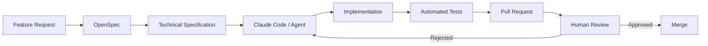

# AI-Augmented Software Engineering
## Contrôler l’IA plutôt que “vibe coder”

 

### Une approche pragmatique pour intégrer les agents IA dans un workflow de développement classique

---

# Le problème

## Ce que l’IA fait très bien

- Produire vite
- Générer du boilerplate
- Explorer des solutions
- Écrire des tests
- Accélérer l’itération

## Ce qu’elle fait mal

- Respecter implicitement les conventions
- Maintenir une architecture cohérente
- Comprendre le contexte métier tacite
- Anticiper les impacts globaux
- Garantir la qualité seule

 

## Risque principal

### Laisser l’agent produire du code sans cadre explicite

---

# L’idée générale

## On ne contrôle pas directement le modèle.

## On contrôle :

 

### 1. Les entrées

- Les spécifications
- Les conventions
- Les règles
- Le contexte fourni

### 2. Les sorties

- Les tests
- Les reviews
- Les pull requests
- Les validations humaines

---

# Stack méthodologique

OpenSpec (léger)

+

Superpowers / Skills

+

Workflow Git/PR classique

+

Tests automatisés forts

+

Review humaine obligatoire

---

# Vue d’ensemble

